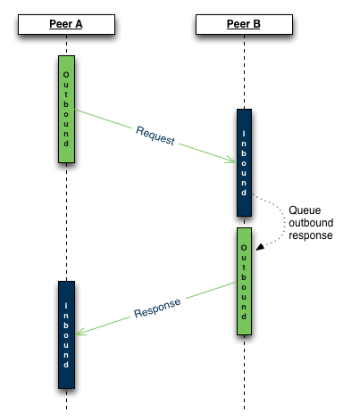
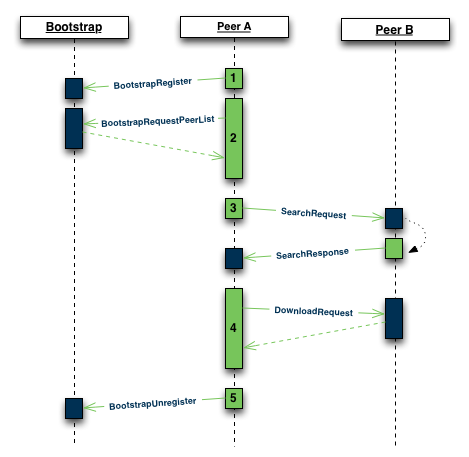

# Pyrate

- [Introduction](#introduction)
- [Message protocol](#message-protocol)
    - [Bootstrap protocol](#bootstrap-protocol)
    - [Peer protocol](#peer-protocol)
- [Client](#client)
    - [Starting a simple client](#starting-a-simple-client)
    - [Client parameters](#client-parameters)
    - [Example client code](#example-client-code)
    - [Bootstrap client](#bootstrap-client)
- [Command objects](#command-objects)
    - [Internal commands](#internal-commands)
        - [Decode](#decode)
    - [Protocol commands](#protocol-commands)
        - [Bootstrap](#bootstrap)
        - [Peer](#peer)
    - [Command object flow](#command-object-flow)
- [Feedback](#feedback)

## Introduction

Pyrate is a primitive P2P filesharing client implemented in Python. Using
sockets and a simple protocol, Pyrate clients maintain a network of peers used
to distribute files to one another.

Each client must register with a Bootstrap node before its connection info can
be distributed to any available peers.

At this point in development, Pyrate is intended for use with text files only.
I have not had a chance to test it with binary files, so proceed at your own
risk.

The project was originally the
[final assignment](http://faculty.washington.edu/lagesse/FinalProj.html) for a
Network Design course taught by Professor Brent Lagesse. After finishing the
course, I chose to continue working on the project because it allows me to
explore the following concepts:

- Producer/Consumer design pattern
- Queueing
- Multithreading
- Sockets
- Peer-to-peer networking

## Message protocol

Pyrate currently uses the same simple protocol provided by Professor Brent
Lagesse. It includes support for the following:

### Bootstrap protocol

Message | Format
--- | ---
Register | `0:ListeningPort`
Request Peer List | `1:MaxNumberOfPeersRequested`
Response Peer List | `IPAddress1,PortNumber1\nIPAddress2,PortNumber2\n (etc.)`
Unregister | `2:ListeningPort`
Keepalive | `3:ListeningPort`

### Peer protocol

Message | Format
--- | ---
Download Response | `FILE`
List Files | `5:`
List Files Response | `Filename1\nFilename2\n (etc.)`
Search | `6:ID:File String:RequestingIP:RequestingPort:TTL`
Search Response | `7:ID:RespondingIP:RespondingPort:Filename`

## Client

### Starting a simple client

The Pyrate network relies on Bootstrap nodes to track available peers for
clients to communicate with.

**TODO:** Finish section

### Client parameters

**bootstrap_addr**
> IP Address of the Bootstrap node you wish to register with

**bootstrap_port**
> Port number of the Bootstrap node you wish to register with

**listen_addr**
> Local address to listen to for incoming connections

**listen_port**
> Local port number to listen to for incoming connections

**keepalive_refresh**
> Number of seconds to wait between KeepAlive requests

**filemonitor_refresh**
> Number of seconds to wait between updating the local file list

**local_directory**
> Path to a local directory to share on the Pyrate network

**log_file**
> Path to a local file containing log information

**max_workers**
> Maximum number of simultaneous worker threads available to process Commands
from the queue

### Example client code

```python
bootstrap_address = 'localhost'
bootstrap_port = 79422
listen_address = 'localhost'
listen_port = 99641
keepalive_refresh = 600
filemonitor_refresh = 60
local_directory = '~/pyrate-files'
log_file = 'pyrate.log'
max_workers = 4

c = Client(
  bootstrap_address,
  bootstrap_port,
  listen_address,
  listen_port,
  keepalive_refresh,
  filemonitor_refresh,
  local_directory,
  log_file,
  max_workers)

c.start()
c.quit()
```

### Bootstrap client

The Pyrate network relies on Bootstrap nodes to track available peers for
clients to communicate with. Bootstrap nodes may be run standalone by
instantiating the `Bootstrap` class.

**TODO:** Finish section

## Command objects

Pyrate uses a producer/consumer queueing model with a user-defined pool of
worker threads. Each Command object corresponds to one of the following types:


### Internal commands

Internal commands provide a way of offloading client-specific tasks into
worker threads.

##### Decode

Rather than monopolize the Listener with the task of decoding incoming
messages, Decode commands are generated each time the Listener receives a
message. Once the Decode object is run by a worker, the received message is
decoded and used to generate a second Command object corresponding to the
message protocol.

### Protocol commands

Because protocol commands require different actions depending whether they
are being sent or received, each protocol message has two corresponding
commands: inbound and outbound. Typically, inbound commands are responsible for
establishing incoming sockets and receiving information, while outbound sockets
are responsible for establishing outgoing connections and sending information.

In some cases, when an outbound command is run on one peer, its reciprocating
inbound command on the other peer may automatically generate an additional outbound
command in response. See Figure 1 below for a sequence diagram of a typical
inbound/outbound interaction.

**Figure 1:** *A typical inbound/outbound command interaction between two
peers.*



#### Bootstrap

- BootstrapRegister
- BootstrapUnregister
- BootstrapRequestPeerList
- BootstrapKeepAlive

#### Peer

- DownloadRequest
- ListRequest
- SearchRequest
- SearchResponse

### Command object flow

Figure 2 illustrates the flow of command objects during typical client
activities.

**Figure 2:** *A typical command sequence.*



1. *Peer A*'s user launches the Pyrate client, causing it to send a
`BootstrapRegister` command to a *Bootstrap node* and join the network.
1. *Peer A* sends a `BootstrapRequestPeerList` command to the *Bootstrap node*
to request a list of peers.
1. *Peer A* wishes to search the network, so its user broadcasts a
`SearchRequest` command to its peers. Fortunately, *Peer B* has the file
sought by *Peer A*, so its client automatically sends a `SearchResponse` back
to *Peer A* letting them know the file is available.
1. *Peer A*'s user, having been notified that a peer posseses the file they
seek, issues the download command. *Peer A*'s client sends a `DownloadRequest`
command to *Peer B*'s client, which then transmits the file.
1. *Peer A*, a notorious leecher, exits the Pyrate client, causing it to send
a `BootstrapUnregister` command to the *Bootstrap node* and leave the network.

## Feedback

Suggestions/improvements [welcome](https://github.com/dougwt/pyrate/issues)!
